# Pemograman Mobile - Pertemuan 5  

Nama: Ahmad Dzul Fadhli Hannan  
Nomor:  02  
Kelas:  TI3F  
NIM:  2341720106

# P1

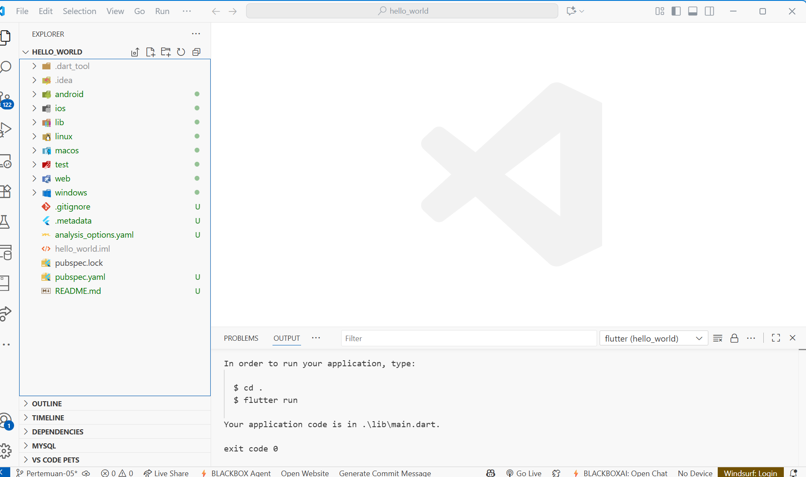  

# P2  

<table>
  <tr>
    <td>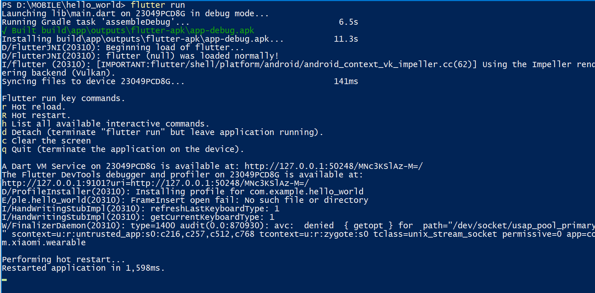</td>
    <td></td>
  </tr>
</table>

# P3  

<table>
  <tr>
    <td>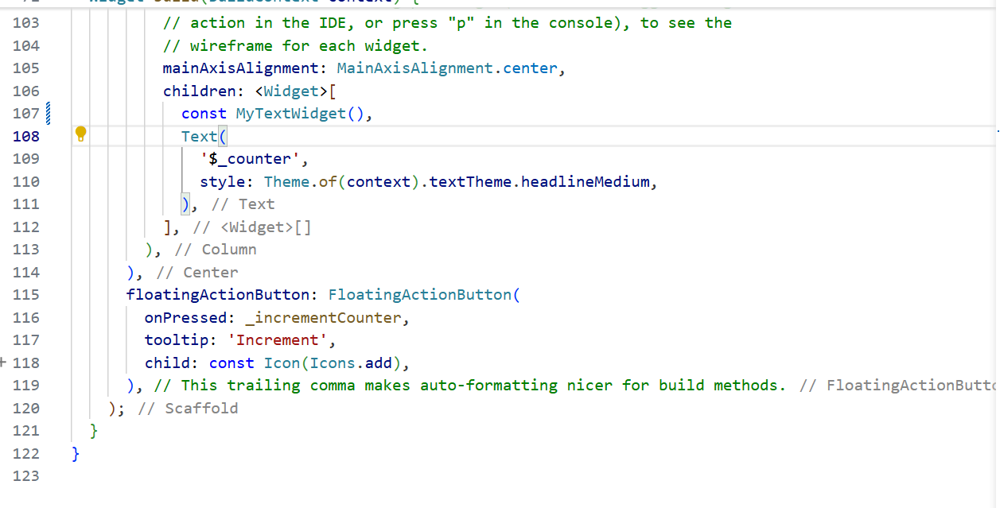</td>
    <td>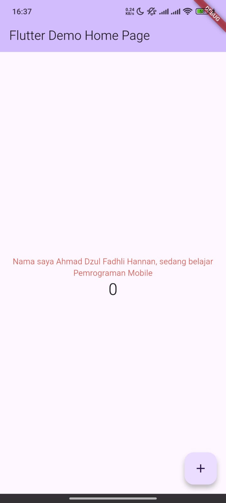</td>
  </tr>
</table>

# P4  

<table>
  <tr>
    <td>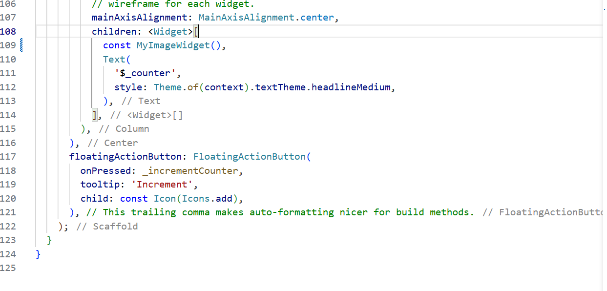</td>
    <td>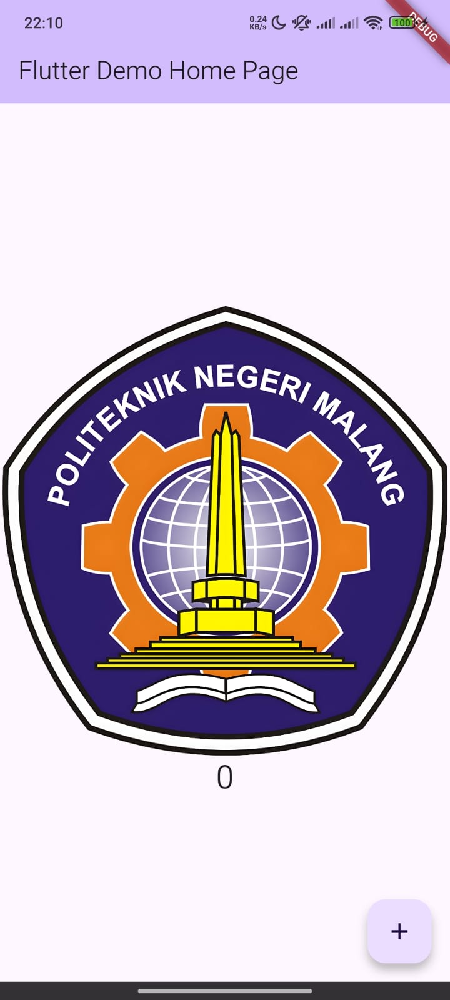</td>
  </tr>
</table>

# P5 

### Langkah 1

<table>
  <tr>
    <td>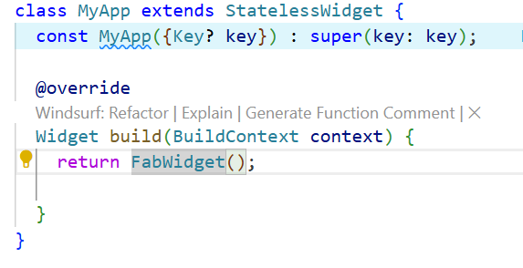</td>
    <td></td>
  </tr>
</table>

### Langkah 2

<table>
  <tr>
    <td>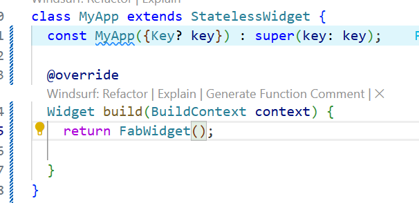</td>
    <td></td>
  </tr>
</table>

### Langkah 3

<table>
  <tr>
    <td>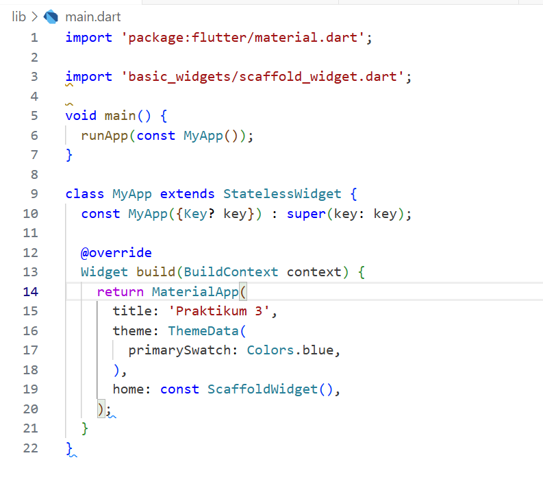</td>
    <td>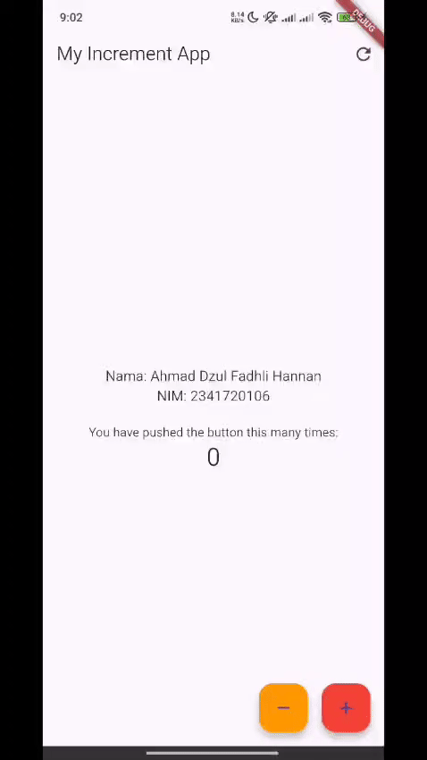</td>
  </tr>
</table>

### Langkah 4

<table>
  <tr>
    <td>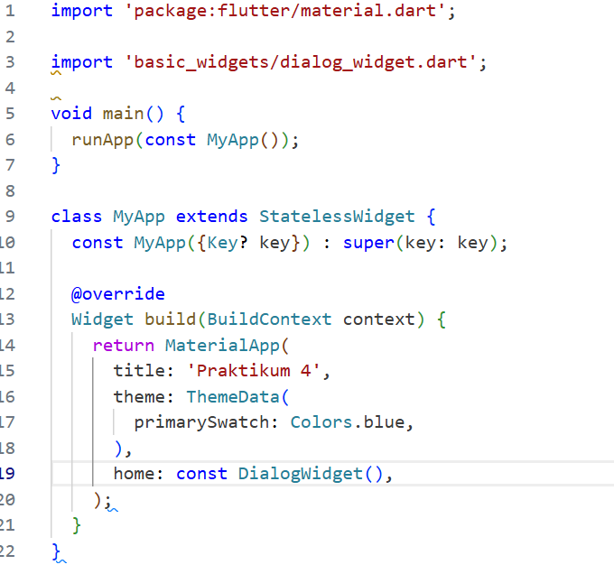</td>
    <td>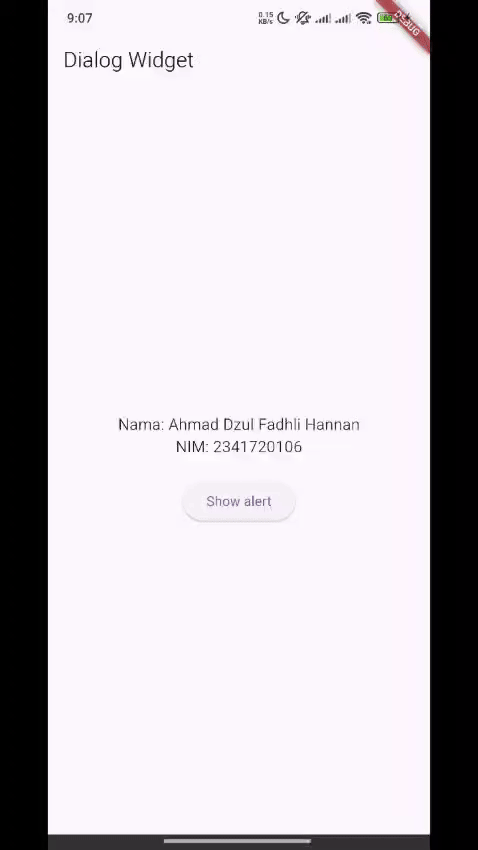</td>
  </tr>
</table>

### Langkah 5

<table>
  <tr>
    <td>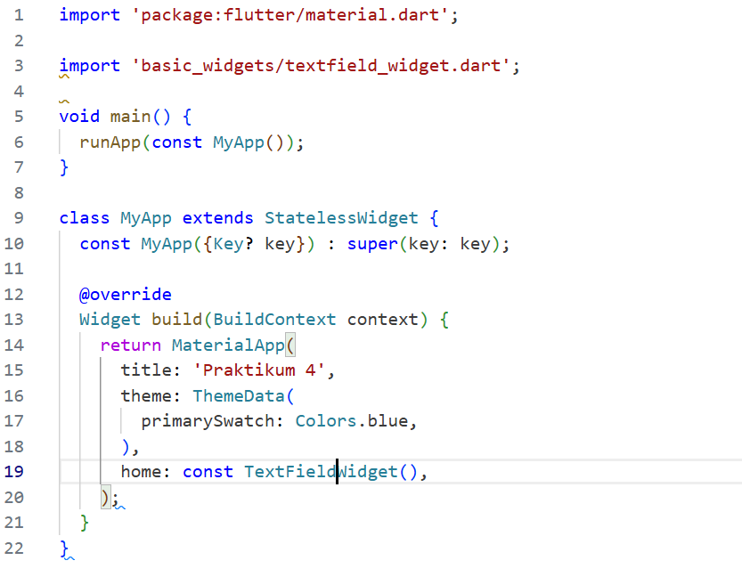</td>
    <td></td>
  </tr>
</table>

### Langkah 6

<table>
  <tr>
    <td>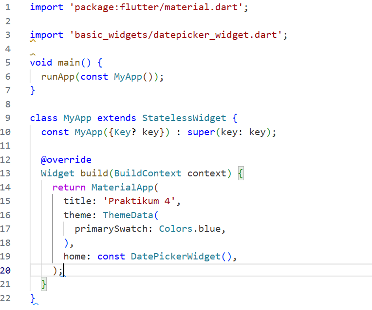</td>
    <td>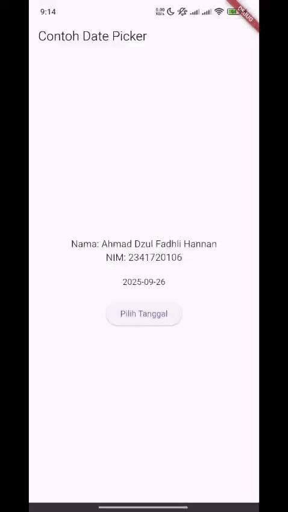</td>
  </tr>
</table>

